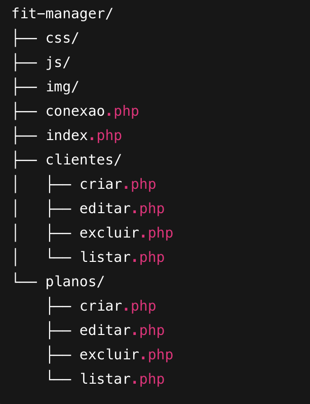

# 🏋️‍♂️ Fit Manager

Sistema de gestão de academia para fins didáticos, com CRUD completo de clientes e planos.

## 📌 Sobre o projeto

O Fit Manager é uma aplicação simples desenvolvida com foco educacional, ideal para quem está aprendendo PHP e lógica de CRUD.
Permite gerenciar clientes e planos de academia, incluindo criação, listagem, edição e exclusão.

## 🛠 Tecnologias utilizadas

PHP
HTML5
CSS3
JavaScript
Bootstrap
VS Code

## 📂 Funcionalidades

✔ Cadastro de clientes
✔ Cadastro de planos
✔ Edição e exclusão de registros
✔ Listagem de dados com layout responsivo
✔ Interface estilizada com Bootstrap
✔ Arquitetura simples para fins didáticos

## Estrutura do Projeto

## 🎯 Objetivo

Projeto criado exclusivamente para fins didáticos, visando prática de CRUD com PHP e front-end básico com Bootstrap.